# awesome-open-design

Community-contributed remixable designs for [OpenDesign Agent Kit](https://github.com/feimacode/open-design-agent-kit).

This repo holds the **community** pool of remixable example designs — a second catalog alongside the curated, built-in examples that ship inside the extension itself. Anyone can contribute a design here; the extension fetches whichever tagged release you (or its default) point it at.

## How this gets consumed

Each tagged release of this repo is a snapshot the extension can fetch at runtime:

- The extension's `openDesign.communityContentRef` setting names a tag from this repo (defaults to the latest tag known at extension release time).
- Running **OpenDesign: Sync Community Designs** (or the extension's own first-run sync) downloads that tag's `examples/` folder into a local cache and merges it into the Gallery, tagged `community` so it's visually distinguishable from the built-in catalog.
- This content is **not reviewed the way the built-in catalog is** — it renders in a slightly more restrictive sandbox and is clearly labeled wherever it appears.

## Examples

<!-- THUMBNAILS:START -->
<table>
<tr>
<td align="center" width="33%">
<a href="examples/achievement-certificate-editorial"></a><br />
<sub><a href="examples/achievement-certificate-editorial">Achievement Certificate — Editorial</a></sub>
</td>
<td align="center" width="33%">
<a href="examples/birthday-invitation-bold">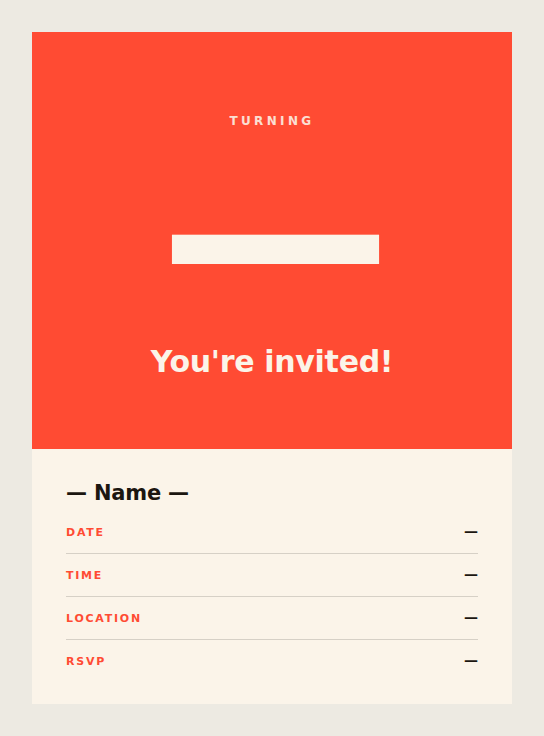</a><br />
<sub><a href="examples/birthday-invitation-bold">Birthday Invitation — Bold</a></sub>
</td>
<td align="center" width="33%">
<a href="examples/claude-macos-notification-banner">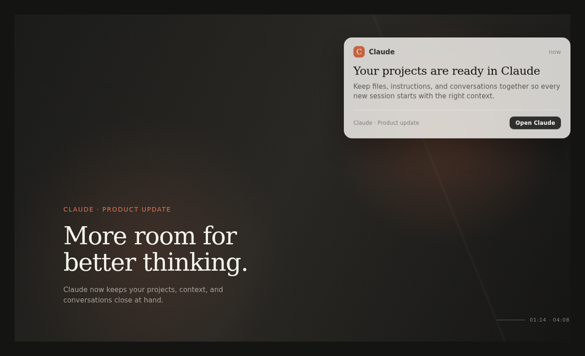</a><br />
<sub><a href="examples/claude-macos-notification-banner">Claude macOS Notification Banner</a></sub>
</td>
</tr>
<tr>
<td align="center" width="33%">
<a href="examples/course-completion-certificate-minimal">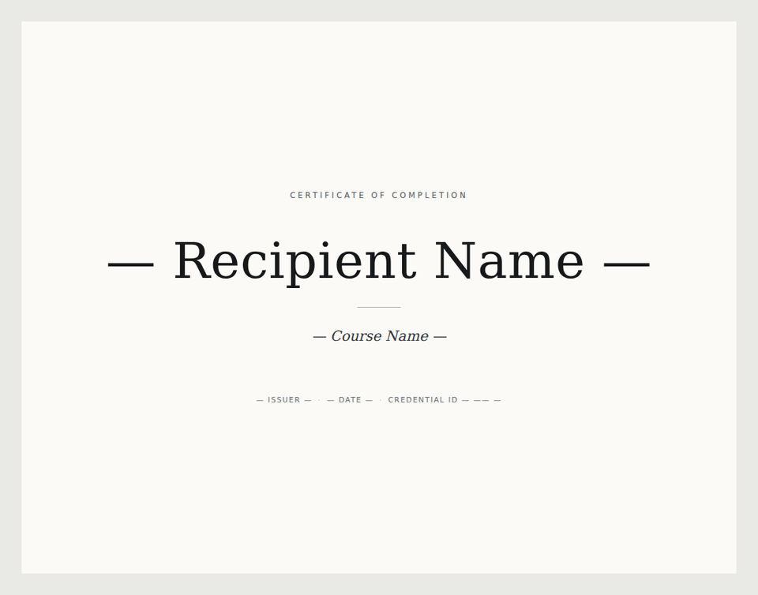</a><br />
<sub><a href="examples/course-completion-certificate-minimal">Course-Completion Certificate — Minimal</a></sub>
</td>
<td align="center" width="33%">
<a href="examples/editorial-serif-resume">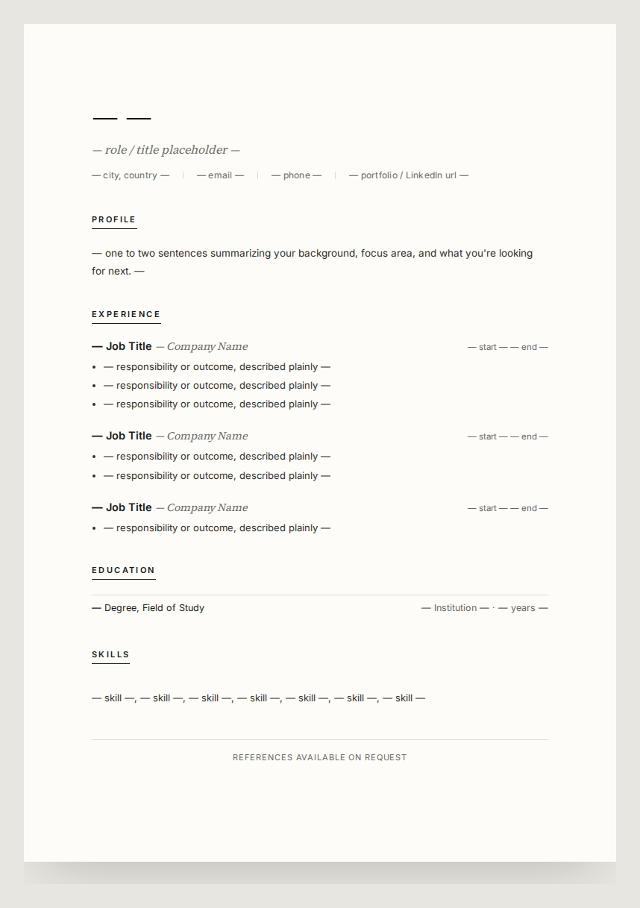</a><br />
<sub><a href="examples/editorial-serif-resume">Editorial Serif Resume</a></sub>
</td>
<td align="center" width="33%">
<a href="examples/field-notes-deck">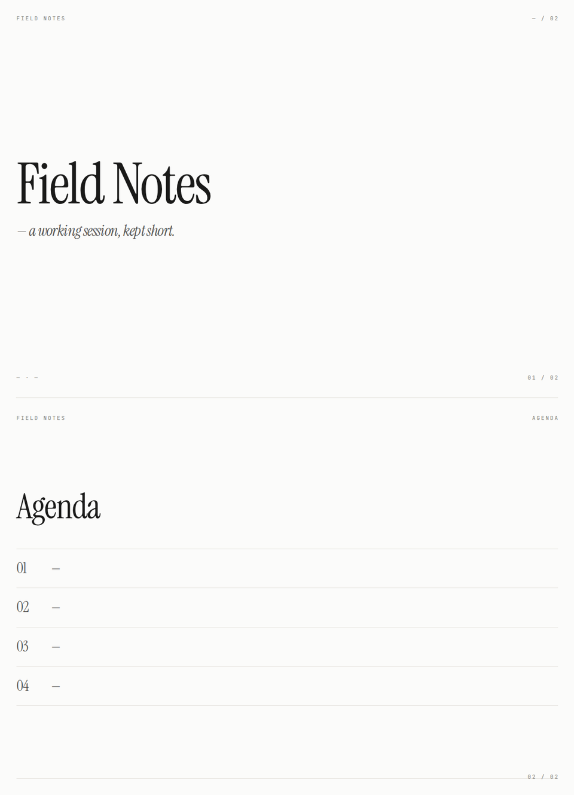</a><br />
<sub><a href="examples/field-notes-deck">Field Notes — Deck Opener</a></sub>
</td>
</tr>
<tr>
<td align="center" width="33%">
<a href="examples/fracture-bloom-poster">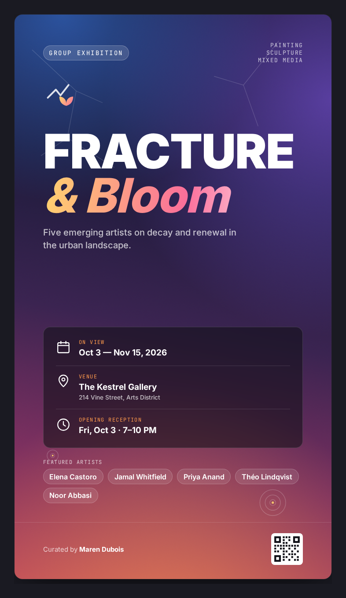</a><br />
<sub><a href="examples/fracture-bloom-poster">Fracture &amp; Bloom — Exhibition Poster</a></sub>
</td>
<td align="center" width="33%">
<a href="examples/grid-collage-announcement">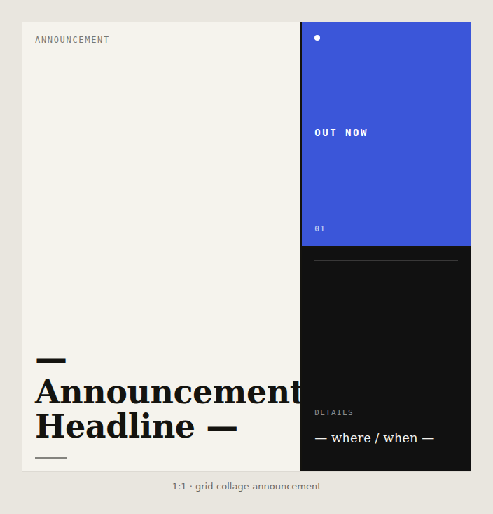</a><br />
<sub><a href="examples/grid-collage-announcement">Grid Collage Announcement Post</a></sub>
</td>
<td align="center" width="33%">
<a href="examples/liquid-bg-hero"></a><br />
<sub><a href="examples/liquid-bg-hero">Liquid Background Hero</a></sub>
</td>
</tr>
<tr>
<td align="center" width="33%">
<a href="examples/metrics-deck-dark">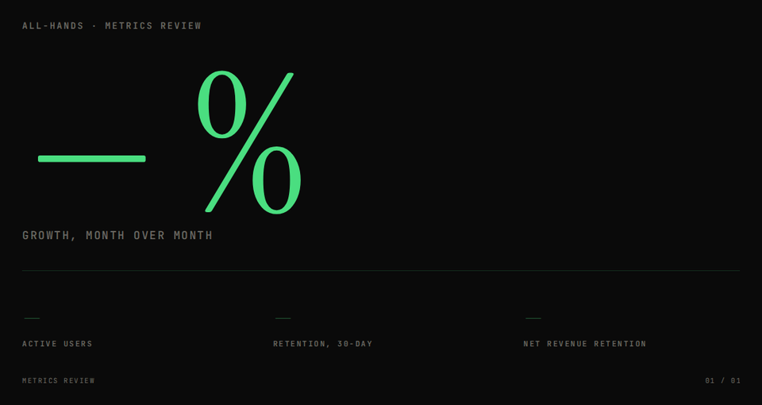</a><br />
<sub><a href="examples/metrics-deck-dark">Dark Metrics — Single Stat Slide</a></sub>
</td>
<td align="center" width="33%">
<a href="examples/minimal-certificate"></a><br />
<sub><a href="examples/minimal-certificate">Minimal Course Completion Certificate</a></sub>
</td>
<td align="center" width="33%">
<a href="examples/modern-wedding-invitation">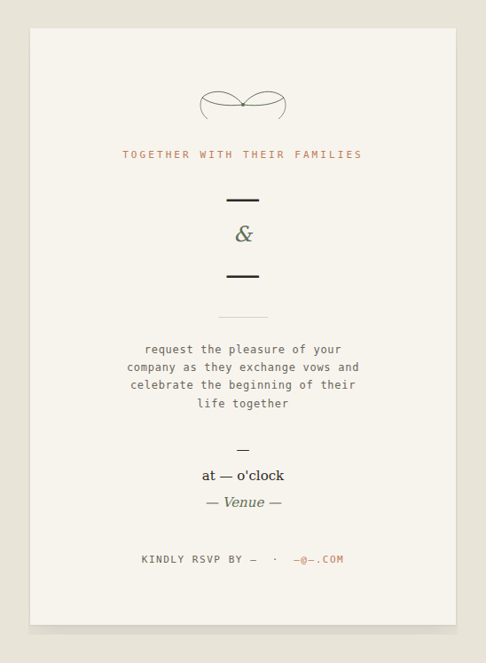</a><br />
<sub><a href="examples/modern-wedding-invitation">Modern Wedding Invitation</a></sub>
</td>
</tr>
<tr>
<td align="center" width="33%">
<a href="examples/monogram-rule-card">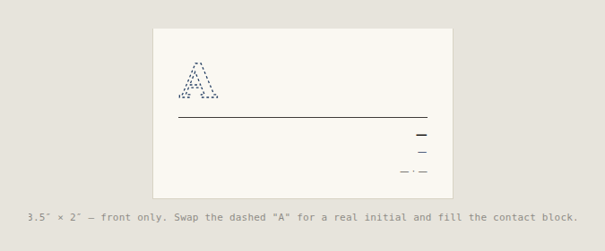</a><br />
<sub><a href="examples/monogram-rule-card">Monogram + Rule Business Card</a></sub>
</td>
<td align="center" width="33%">
<a href="examples/nightlife-gig-flyer">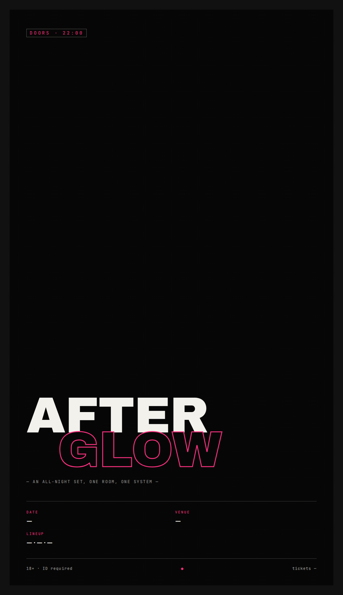</a><br />
<sub><a href="examples/nightlife-gig-flyer">Nightlife / Gig Flyer</a></sub>
</td>
<td align="center" width="33%">
<a href="examples/now-page">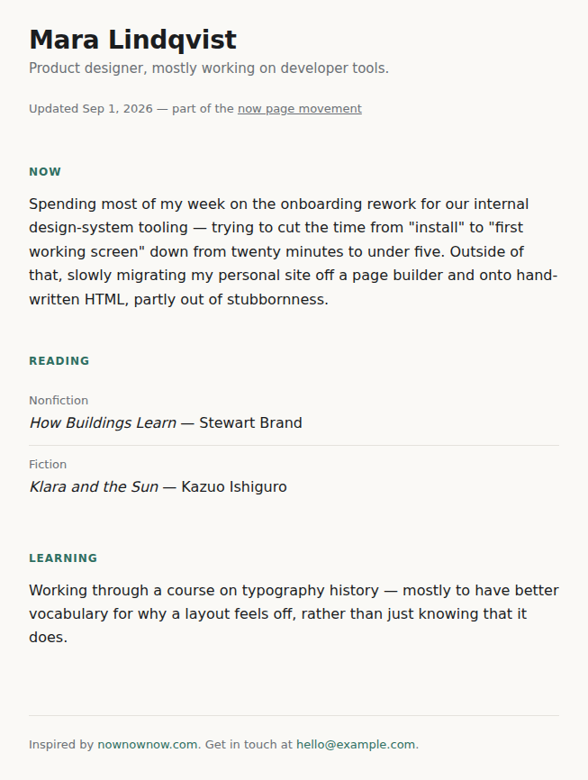</a><br />
<sub><a href="examples/now-page">Now Page</a></sub>
</td>
</tr>
<tr>
<td align="center" width="33%">
<a href="examples/quote-carousel-card">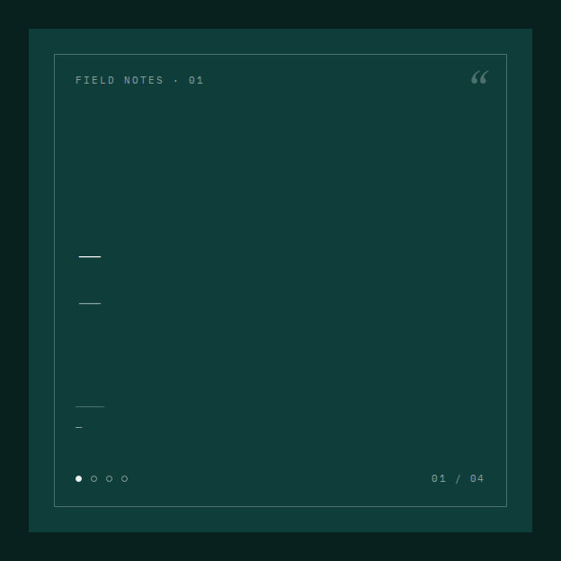</a><br />
<sub><a href="examples/quote-carousel-card">Quote Carousel Card</a></sub>
</td>
<td align="center" width="33%">
<a href="examples/two-column-mono-resume">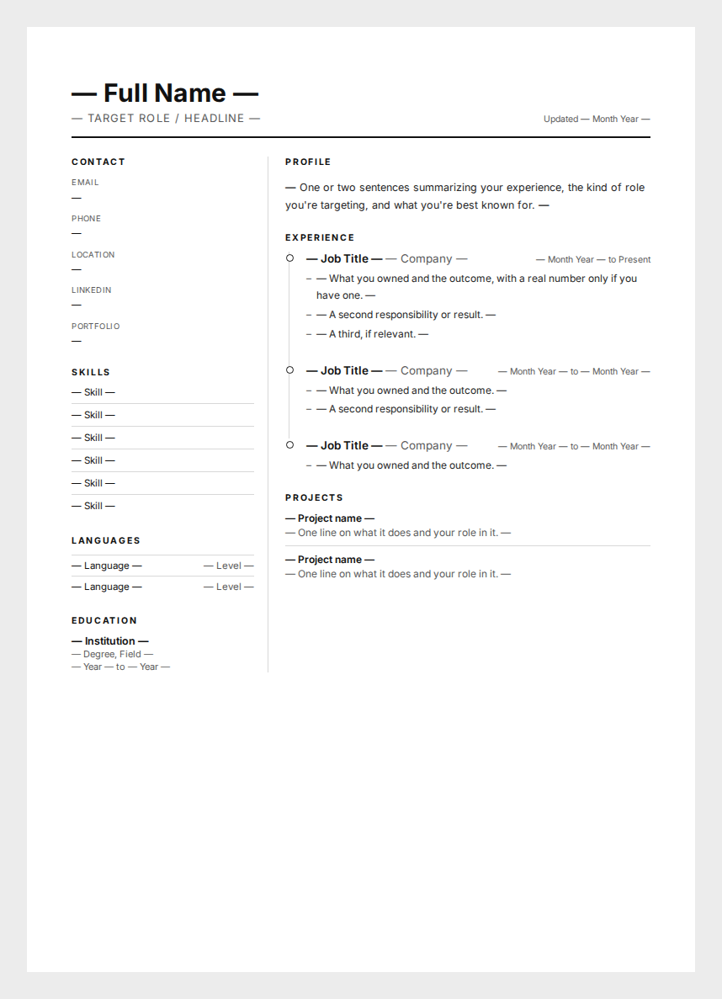</a><br />
<sub><a href="examples/two-column-mono-resume">Two-Column Monochrome Resume</a></sub>
</td>
<td align="center" width="33%">
<a href="examples/warm-birthday-card"></a><br />
<sub><a href="examples/warm-birthday-card">Warm Birthday Card</a></sub>
</td>
</tr>
<tr>
<td align="center" width="33%">
<a href="examples/warm-minimal-card">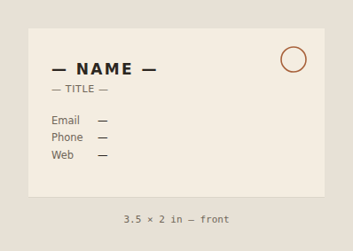</a><br />
<sub><a href="examples/warm-minimal-card">Warm Minimal Business Card</a></sub>
</td>
<td align="center" width="33%">
<a href="examples/workshop-meetup-flyer">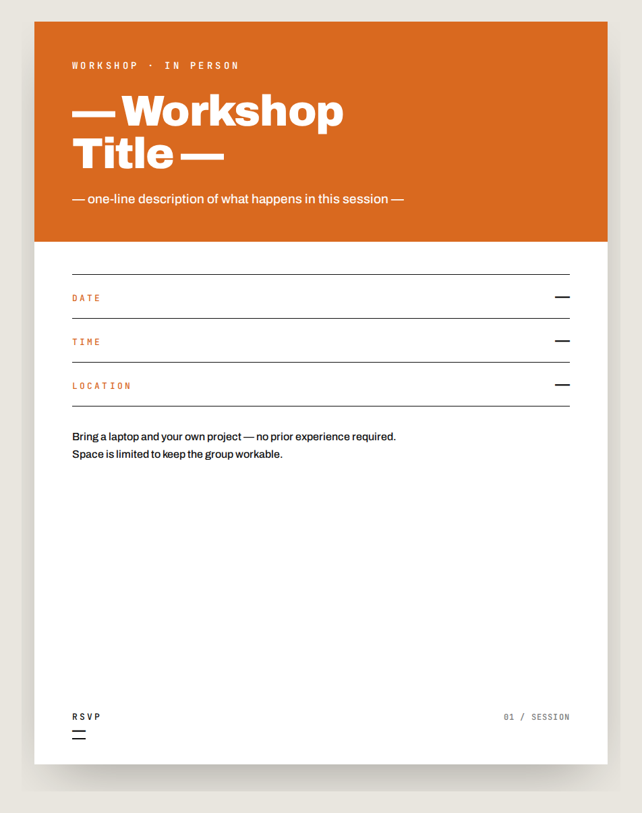</a><br />
<sub><a href="examples/workshop-meetup-flyer">Workshop / Meetup Flyer</a></sub>
</td>
<td></td>
</tr>
</table>
<!-- THUMBNAILS:END -->

## Structure

```
examples/
  <design-slug>/
    SKILL.md         # frontmatter + workflow instructions, same shape Claude Code skills use
    example.html     # the hand-built, rendered example — this is what gets remixed
    open-design.json # optional: carries the example's starter prompt (od.useCase.query.en)
    thumbnail.png    # auto-generated by CI from example.html — don't add this yourself
```

## Contributing

See [CONTRIBUTING.md](CONTRIBUTING.md).

## Releasing

Maintainers cut a new tag (e.g. `v0.2.0`) whenever a meaningful batch of new/updated designs lands on `main`. Extension users track a specific tag, so nothing changes for them until they (or a future extension default) move to a newer one.

## License

[MIT](LICENSE). By contributing, you agree your contribution is licensed under the same terms — see CONTRIBUTING.md for the one exception (a design ported from elsewhere, which keeps its original license and attribution).
